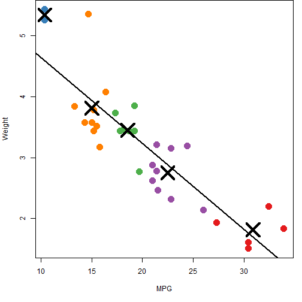

Linear Exploration Application
========================================================
author: Chris Hammond
date: 6/2/2016
autosize: true
font-family: 'Helvetica'


A Tool for Quick Analysis
========================================================

The purpose of the Linear Exploration Application is to facilitate the quick visual exploration of two related numeric variables. The primary function of the application is to show a scatter plot of the data points, fit a linear regression line and perform k-means clustering. Additionally, the summary tab contains basic information about the data, linear model and k-means clustering. Seven datasets are included for exploration. 

Features:

- Fast ~ Quickly visualize relationships in numeric data.
- Flexible ~ Easily add additional datasets to source code.
- Friendly ~ Simple for novice users to learn and utilize.


Fast, Flexible, Friendly
========================================================
type: prompt
autosize: true

New datasets are easy to add to the Linear Exploration Application. 

1. Read the dataset in to R.
2. Do any desired data cleaning.
3. Add it to the list of datasets.
4. Add the name of the dataset to the list.

In the global.R file:


```r
kepler <- read.csv("cumulative.csv", skip=55)
rawData <- list(kepler, mtcars, USArrests, iris, quakes, swiss, women) # Add datasets here
datasets[,dataNames] <- c('Exoplanets', 'MT Cars', 'US Arrests', 'Iris Data', 'Fiji Quakes', 'Swiss', 'Measurements') # Add name here
```

Data Visualization
========================================================

The app generates colorful scatter plots with fitted linear models and k-means clustering.



Try the App!
========================================================
type: alert

* Visit shinyapps.io to try out the [Linear Exploration Application](https://crhammond88.shinyapps.io/Linear_Calculator/).
* Source code is available on [GitHub](https://github.com/crhammond88/ddp-shiny-project).
* If you haven't already, check out the [Data Science Specialization](https://www.coursera.org/specializations/jhu-data-science/) from John Hopkins University & Coursera.
